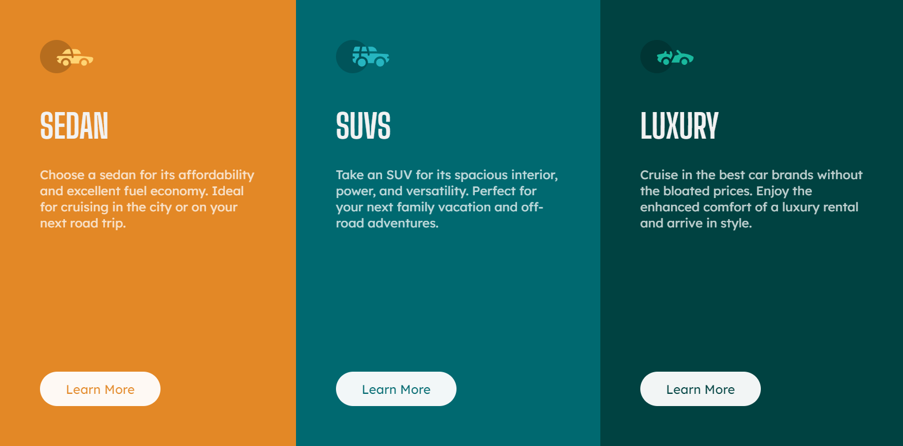

# Frontend Mentor - 3-column preview card component solution

This is a solution to the [3-column preview card component challenge on Frontend Mentor](https://www.frontendmentor.io/challenges/3column-preview-card-component-pH92eAR2-). Frontend Mentor challenges help you improve your coding skills by building realistic projects.

## Table of contents

-   [Overview](#overview)
    -   [The challenge](#the-challenge)
    -   [Screenshot](#screenshot)
    -   [Links](#links)
-   [My process](#my-process)
    -   [Built with](#built-with)
    -   [What I learned](#what-i-learned)
    -   [Continued development](#continued-development)
    -   [Useful resources](#useful-resources)
-   [Author](#author)
-   [Acknowledgments](#acknowledgments)

**Note: Delete this note and update the table of contents based on what sections you keep.**

## Overview

### The challenge

Users should be able to:

-   View the optimal layout depending on their device's screen size
-   See hover states for interactive elements

### Screenshot

Desktop

Mobile

### Links

-   [Solution URL](https://github.com/NataJenkins/3-column-preview-card-component)
-   [Live Site URL](https://incredible-fenglisu-785834.netlify.app)

## My process

### Built with

-   Semantic HTML5 markup
-   CSS custom properties
-   Flexbox
-   CSS Grid
-   Mobile-first workflow
-   [React](https://reactjs.org/) - JS library

**Note: These are just examples. Delete this note and replace the list above with your own choices**

### What I learned

I learned how to set transparent text on a button.

https://codepen.io/KristinB/pen/WYrOQm

### Useful resources

-   [Transparent text on buttons](https://codepen.io/KristinB/pen/WYrOQm) - here is the way i liked the most to set button text to transparent.

**Note: Delete this note and replace the list above with resources that helped you during the challenge. These could come in handy for anyone viewing your solution or for yourself when you look back on this project in the future.**

## Author

-   Github - [NataJenkins](https://github.com/NataJenkins)
-   Frontend Mentor - [@NataJenkins](https://www.frontendmentor.io/profile/NataJenkins)
-   Linkedin - [natalia0896](https://www.linkedin.com/in/natalia0896/)
